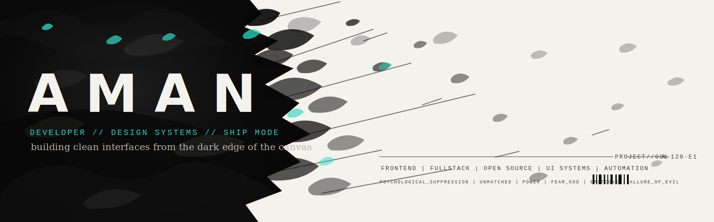

<p align="center">
  
</p>

<p align="center">
  
</p>

```txt
role      developer / designer
based     India
building  sharp web experiences and useful automation
stack     React / Next.js / Node.js / TypeScript
status    focused, curious, shipping
```

> I build practical interfaces with a taste for strong visual systems.
> The current lane is full-stack web work: fast frontends, clean APIs, and small automations that remove friction.
> I like products that feel intentional from the first pixel to the final commit.

<p align="center">
  
  
  
  
  
  
  
</p>

<p align="center">
  
  
</p>

<p align="center">
  
</p>

<p align="center">
  <a href="https://github.com/Aman0choudhary">
    
  </a>
  <a href="https://www.linkedin.com/in/aman">
    
  </a>
  <a href="mailto:aman@example.com">
    
  </a>
</p>

<p align="center">
  <samp>FRONTEND | FULLSTACK | OPEN SOURCE | UI SYSTEMS | AUTOMATION</samp>
</p>
